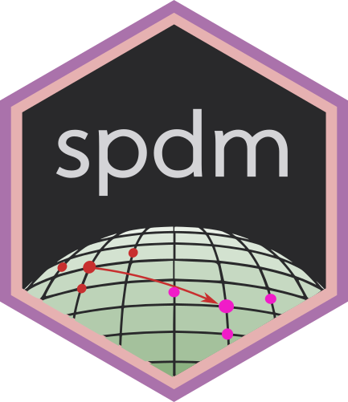

# spdm 

The **spdm** package contains outines for the analysis of symmetric, positive-definite (SPD) matrices. For in-depth details and instructions, see the [documentation](https://areshenk-rpackages.github.io/spdm).

**spdm** is designed largely for geometry-respecting manipulation and analysis of covariance matrices -- that is, methods which respect the natural Riemannian-manifold structure of the space of SPD matrices. Although these methods have been geared towards the analysis of fMRI functional connectivity, the package itself is flexible and domain agnostic. Features include:

- Regularized covariance estimation.

- Means, interpolation, and distance measures for covariance matrices.

- Translation of covariance matrices by parallel transport.

- Principal geodesic analysis, and other dimension reduction techniques on the space of SPD matrices.
