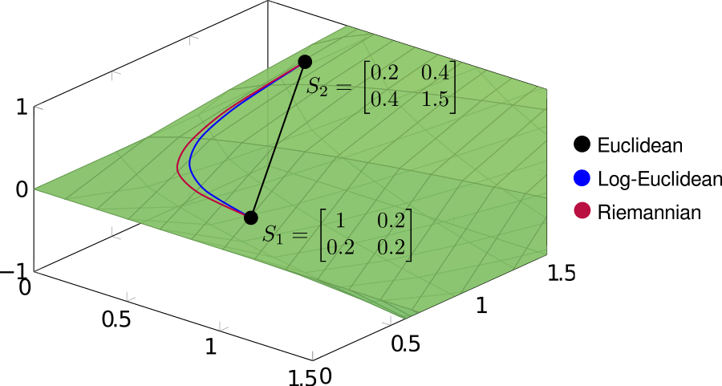

```{r setup, include = FALSE}
library(spdm)
knitr::opts_chunk$set(
  collapse = TRUE,
  comment = "#>"
)
```

**spdm** implements three forms of interpolation between covariance matrices, using the function `spd.interpolate()`:

- Euclidean interpolation (`method = 'euclidean'`), defined by
$$ I_{S_1,S_2}(t) = (1-t)S_1 + tS_2 $$
- Log-Euclidean interpolation (`method = 'logeuclidean'`), defined by
$$ I_{S_1,S_2}(t) = \exp{[(1-t)\log{S_1} + t\log{S_2}]}, $$
where $\exp{}$ and $\log{}$ denote the matrix exponential and matrix logarithm.

- Riemannian interpolation (`method = 'riemannian'`), defined by
$$ I_{S_1,S_2}(t) = \exp_{S_1}{[t\log_{S_1}{S_2}]}, $$
where $\exp{}$ and $\log{}$ denote the matrix exponential and matrix logarithm, and the subscript denotes the (Riemannian) exponential and log maps taken at the specified basepoint.

These three methods can be interpreted, respectively, as direct linear interpolation (euclidean), linear interpolation after projecting onto the tangent space at the identity matrix (log-euclidean), and geodesic interpolation (riemannian). In order to see the different behaviors of the three methods, it's useful to draw the interpolating paths explicitly. In the following example, we'll interpolate between two covariance matrices

$$ S_1 = \begin{bmatrix} 1 & 0.2 \\ 0.2 & 0.2\end{bmatrix}
 \hspace{2em} S_2 = \begin{bmatrix} 0.2 & 0.4 \\ 0.4 & 1.5\end{bmatrix}.$$

using each of the three methods.

```{r}
# Define source and target covariance matrices
S1 <- matrix(c(1, .2, .2, .2), 2, 2)
S2 <- matrix(c(.2, .4, .4, 1.5), 2, 2)

# Interpolate at equally spaced points
interp <- seq(0, 1, .2)

# Interpolation
path.euclidean <- lapply(interp, function(t) 
    spd.interpolate(S1, S2, t, method = 'euclidean'))

path.logeuclidean <- lapply(interp, function(t) 
    spd.interpolate(S1, S2, t, method = 'logeuclidean'))

path.riemannian <- lapply(interp, function(t) 
    spd.interpolate(S1, S2, t, method = 'riemannian'))
```

The resulting paths are shown below on the cone of symmetric positive-definite matrices. 

```{r, echo=FALSE, fig.align = 'center'}
# All defaults

```

Note that both log-Euclidean and Riemannian interpolation produce curved paths. This seemingly undesirable behavior is actually a consequence of the geometry of the cone, the result of which being that standard (Euclidean) operations often distort the spectral properties of covariance matrices.

As discussed in another page I'll eventually get around to writing, the positive cone is arranged as a set of nested shells of constant determinant, which (in a rough, intuitive sense) encode information about the dimensionality of a covariance matrix. For a fixed norm, the greatest determinant is achieved for the isotropic matrices $\sigma^2 \bf{I}$ at the center of the cone. The result is that linear interpolation between matrices lying on opposite sides of the cone generates paths passing through the center, into a zone of higher determinant. In contrast, both log-Euclidean and Riemannian interpolation produce paths which roughly follow an iso-determinant shell. We can see this by computing the determinant of the interpolating matrices:

```{r, echo=FALSE, out.width = "1000px", fig.align = 'center'}
# All defaults

```

Note that `method = c('logeuclidean', 'riemannian')` are considerably slower than `method = c('euclidean')`, and are not well optimized (e.g. interpolating at multiple steps requires computing the exponential and logarithms multiple times), and so in higher dimensions interpolating at a large numbers of timesteps can be time consuming. This is a relatively simple fix, and will likely be implemented shortly, but for now interpolating at multiple timesteps must be done in a loop, or by using `lapply()`.
